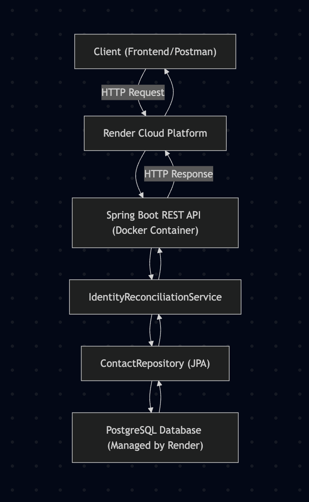
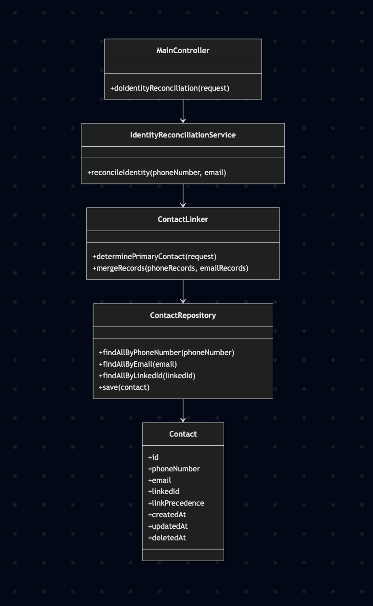

# Identity Reconciliation Service

This project implements the [Bitespeed Backend Task: Identity Reconciliation](https://bitespeed.notion.site/Bitespeed-Backend-Task-Identity-Reconciliation-1fb21bb2a930802eb896d4409460375c).

## Solution Endpoint

**POST** `https://identity-reconciliation-f3k8.onrender.com/identity`

### Request Example

Send a JSON payload with one or both fields:

```json
{
  "phoneNumber": "9876543210",
  "email": "user@example.com"
}
```

### Response Example

```json
{
  "primaryContactId": 1,
  "emails": ["user@example.com"],
  "phoneNumbers": ["9876543210"],
  "secondaryContactIds": [2, 3]
}
```

## Tech Stack

- **Java 17**
- **Spring Boot**
- **PostgreSQL** (database)
- **JPA/Hibernate** (ORM)
- **Docker** (for containerization)
- **JUnit** (for testing)
- **Render** (for deployment)

## System Architecture




## Class Diagram




## Usage

- Clone this repository.
- See the [task description](https://bitespeed.notion.site/Bitespeed-Backend-Task-Identity-Reconciliation-1fb21bb2a930802eb896d4409460375c) for requirements and details.
- Use the standardized endpoint above to test the solution.